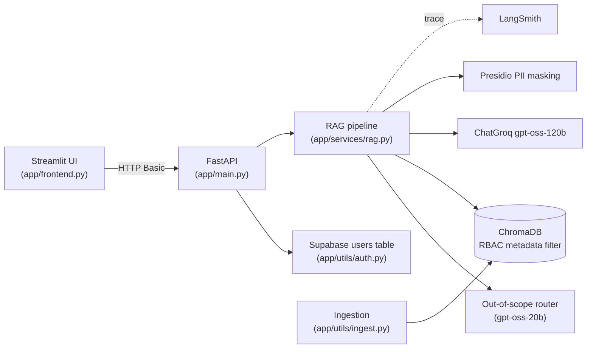

# FinSolve Technologies - Internal RAG Chatbot with Role-Based Access Control

An internal, production-oriented RAG chatbot that answers questions about FinSolve's
company data, but **only within the data scope of the asking employee's role**.

The system combines metadata-filtered retrieval (RBAC), prompt-based out-of-scope
routing, PII anonymization, source-based authentication, tracing, and automated
evaluation.

---

## Architecture



**Request flow for `POST /chat`:**

1. HTTP Basic auth against the Supabase `users` table.
2. Out-of-scope router decides whether the question is about FinSolve internal data.
3. Vector search in ChromaDB with a `{"department": <role>}` metadata filter.
4. Small-to-big expansion returns each hit's parent section to the LLM.
5. `gpt-oss-120b` answers using **only** the retrieved context.
6. Presidio masks PII (PERSON, PHONE_NUMBER, EMAIL_ADDRESS, US_SSN) in the response.

---

## Tech stack

| Concern | Technology |
|---|---|
| Backend API | FastAPI (Python 3.10+) |
| Frontend | Streamlit |
| LLM orchestration | LangChain |
| Vector DB | ChromaDB (persistent, local) |
| Embeddings | HuggingFace `sentence-transformers/all-MiniLM-L6-v2` |
| LLM | ChatGroq `openai/gpt-oss-120b` (answers), `openai/gpt-oss-20b` (router) |
| Document parsing | Docling (`.md`), LangChain `CSVLoader` (`.csv`) |
| Guardrails | Microsoft Presidio (PII), prompt-based router (out-of-scope) |
| Relational DB | Supabase (Postgres) via `supabase-py` for users/auth + RBAC roles |
| Observability / Eval | LangSmith (tracing), Ragas (evaluation) |

> Note: the original `llama3-70b-8192` model was decommissioned by Groq; the stack
> uses `openai/gpt-oss-120b` and `openai/gpt-oss-20b` as the recommended replacements.

---

## Project structure

```
.
├── app/
│   ├── schemas/
│   │   └── chat.py            # Pydantic request/response models
│   ├── services/
│   │   ├── rag.py             # Retrieval (small-to-big), prompt, answer pipeline
│   │   └── guardrails.py      # Out-of-scope router + PII masking
│   ├── utils/
│   │   ├── auth.py            # Supabase client, user lookup, password verify
│   │   ├── ingest.py          # Docling + CSVLoader ingestion into ChromaDB
│   │   └── seed_users.py      # One-off script to seed the Supabase users table
│   ├── __init__.py
│   ├── main.py                # FastAPI app (auth, /login, /test, /chat)
│   └── frontend.py            # Streamlit chat UI
├── resources/
│   └── data/
│       ├── engineering/       # engineering_master_doc.md
│       ├── finance/           # financial_summary.md, quarterly_financial_report.md
│       ├── general/           # employee_handbook.md
│       ├── hr/                # hr_data.csv
│       └── marketing/         # marketing reports (.md)
├── eval.py                    # Ragas evaluation on 3 sample queries
├── pyproject.toml
└── README.md
```

---

## RBAC model

The ingestion script reads the **folder name** under `resources/data/` and stores it
as the `department` metadata on every chunk. Retrieval then filters on it.

| Role | Access scope (Chroma filter) |
| :--- | :--- |
| `finance` | `{"department": "finance"}` |
| `hr` | `{"department": "hr"}` |
| `marketing` | `{"department": "marketing"}` |
| `engineering` | `{"department": "engineering"}` |
| `c_level` | no filter (sees everything) |
| `general` | `{"department": "general"}` |

RBAC is enforced **at the vector-store query**, not in the prompt - unauthorized
chunks are never retrieved, let alone sent to the LLM.

Demo users seeded by `seed_users.py`:

| Username | Password | Role |
| :--- | :--- | :--- |
| Tony | `password123` | engineering |
| Peter | `pete123` | engineering |
| Sam | `financepass` | finance |
| Bruce | `securepass` | marketing |
| Sid | `sidpass123` | marketing |
| Natasha | `hrpass123` | hr |

---

## Setup

```bash
python -m venv .venv
# Windows:  .\.venv\Scripts\activate
# macOS/Linux:  source .venv/bin/activate
python -m pip install --upgrade pip
pip install -e .
python -m spacy download en_core_web_lg   # required by Presidio
```

Create `.env` in the project root:

```env
GROQ_API_KEY=...
SUPABASE_URL=...
SUPABASE_KEY=...
HF_TOKEN=...                    # optional, speeds up model downloads
LANGCHAIN_TRACING_V2=true       # must be lowercase "true"
LANGCHAIN_API_KEY=...
LANGCHAIN_PROJECT=finsolve-rbac-chatbot
```

Create the Supabase table and seed users:

```sql
create table if not exists users (
  username text primary key,
  password_hash text not null,
  role text not null
);
alter table public.users disable row level security;   -- personal/demo setup
```

```bash
python -m app.utils.ingest --reset      # parse + embed + persist to ChromaDB
python -m app.utils.seed_users          # upsert demo users
```

---

## Running

```bash
# Terminal 1 - backend
python -m uvicorn app.main:app --reload

# Terminal 2 - frontend
streamlit run app/frontend.py
```

The API is at `http://localhost:8000` (interactive docs at `/docs`); the UI is at
`http://localhost:8501`. Log in with any demo user and ask questions.

---

## API

| Method | Path | Auth | Description |
| :--- | :--- | :--- | :--- |
| GET | `/login` | Basic | Validate credentials, return role |
| GET | `/test` | Basic | Auth smoke test |
| POST | `/chat` | Basic | Ask a question, returns `{answer, department}` |

`POST /chat` body:

```json
{ "message": "What does the engineering document say about system architecture?" }
```

---

## Guardrails

**Out-of-scope routing.** A cheap `gpt-oss-20b` LLM classifies each question before
retrieval. Anything not about FinSolve internal data returns exactly:
`"I can only answer questions related to FinSolve's internal data."`

**PII masking.** Presidio detects and masks `PERSON`, `PHONE_NUMBER`,
`EMAIL_ADDRESS`, and `US_SSN` in the final response, regardless of role. Masking is
applied to every response, so even a refusal that echoes a name comes back masked.

---

## Retrieval design: small-to-big

`.md` files are parsed with Docling and split by heading
(`MarkdownHeaderTextSplitter`), so a chunk never mixes two sections. Each chunk
embeds a small, precise text but carries its full parent section in `parent_text`.

At query time the system matches small chunks (precise recall) and then expands each
hit back to its parent section (self-sufficient context) before sending it to the
LLM. This resolved a measurable precision problem caused by small, fragmented
chunks - see the evaluation below.

---

## Evaluation

`eval.py` runs three sample queries through the full pipeline and scores them with
Ragas (`Faithfulness`, `AnswerRelevancy`, `ContextPrecision`, `ContextRecall`).

| Configuration | Faithfulness | AnswerRelevancy | ContextPrecision | ContextRecall |
| :--- | :---: | :---: | :---: | :---: |
| Flat 1000-char chunks | 1.00 | 0.82 | 0.78 | 1.00 |
| Heading chunks only | 1.00 | 0.87 | 0.53 | 1.00 |
| **Heading chunks + small-to-big** | 1.00 | 0.84 | **0.92** | 1.00 |

```bash
python eval.py          # writes eval_results.csv
```

Run with `PYTHONIOENCODING=utf-8` on Windows so special characters in the source
documents can be printed.

---

## Design decisions and tradeoffs

**RBAC at retrieval, not at generation.** Access control is a metadata filter on the
vector search. The LLM is never given data the user may not see, so there is nothing
to "forget" or leak in the prompt.

**PII masking is unconditional.** Even when a user already typed a name, it is
masked in the response. This keeps one consistent, auditable rule (matching the
spec) and protects names the user did *not* ask about - e.g. an aggregate query that
surfaces many employees. Selective "unmask if the user already knew it" logic would
require per-entity provenance tracking and opens echo/oracle attack paths.

**Business data is protected by RBAC, not by masking.** Salary, employee IDs, and
dates of birth are business data behind role-gated retrieval, not identity leaks, so
they are intentionally *not* masked - HR must be able to read them. Masking was
rejected here because it would block the legitimate user while being trivially
bypassed by LLM reformatting (e.g. `1,332,478.37` versus `1332478.37`).

**Small-to-big over a reranker.** A cross-encoder reranker was evaluated and
provided no measurable benefit on this corpus, so it was removed in favour of
small-to-big expansion, which improved context precision without an extra model.

**LangSmith tracing is enabled with lowercase `true`.** The LangSmith SDK compares
the tracing flag against the literal string `"true"`; `True` silently disables
tracing.

---

## Known limitations

- **Free-tier token limits.** The Groq free tier allows 200k tokens/day for
  `gpt-oss-120b`; large parent contexts consume this quickly, so repeated evaluation
  runs may hit rate limits.
- **Presidio false positives.** Technical terms such as "Android" or "Kotlin" can be
  masked as `<PERSON>`. A domain denylist would reduce this.
- **Small evaluation set.** Ragas is run on three queries; the numbers are
  directional, not statistically robust.
- **Demo authentication.** HTTP Basic with a plaintext password over a mock user
  table. Production would use hashed credentials and token-based auth (Supabase Auth).
